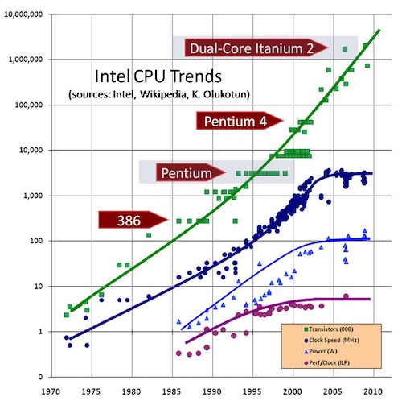
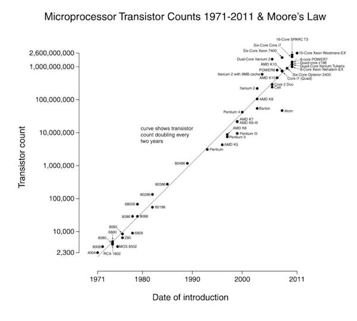
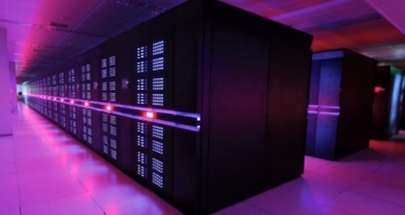

class: middle, center

# High Performance Scientific Computing

## AMath 483/583 Spring 2016

**Instructor**

Chris Swierczewski

**Teaching Assistants**

Meghana Velegar, Sean Santos

---

# Moore's Law Broken

.center[]

---

# Moore's Law Fixed

.center[]

---

# High Performance Computing

.center[]

* Current fastest computer: TIANHE-2
  * 3,120,000 cores
  * 33.86 petaflop/s (quadrillions of calculations per second)
  * approx. 1,525 TB RAM (1 TB = 1000 GB)

---

# Course Objectives

* computer hardware and software essentials
* techniques for writing fast code: single-core and multi-core
* applications to scientific computing problems

Knowledge gained from course will be useful on supercomputers as well as desktop
(or laptop) machines.

---

# Overview of Topics

* **Program Efficiency**
  * computer hardware: CPUs and memory, floating point arithmetic, cache
  * Unix and command-line software development
  * languages: Python and C, compiled vs. interpreted
  * efficient single-core programming
  * parallel programming with OpenMP and MPI
  * GPU programming with CUDA

* **Programmer Efficiency**
  * version control systems
  * makefiles and scripting
  * debugging code
  * test suites
  * reproducibility

---

# Many Topics, Little Time

* my goal is to get you started
  * learn to seek out information
  * I will give you many resources
* learn by example
* many examples, hands-on-experience

.center[**You will get out of this class what you put into it**]

---

# Syllabus

---

# Homework

---

# Quizzes

---

# Final Project and Exam

---

# Getting Help and Resources

---

